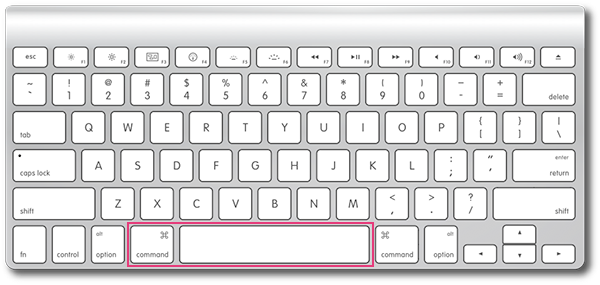
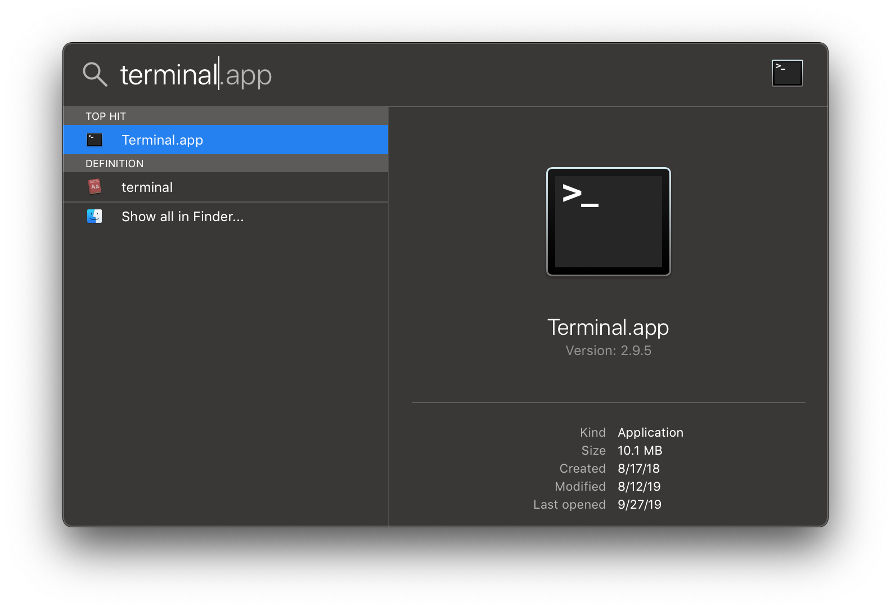
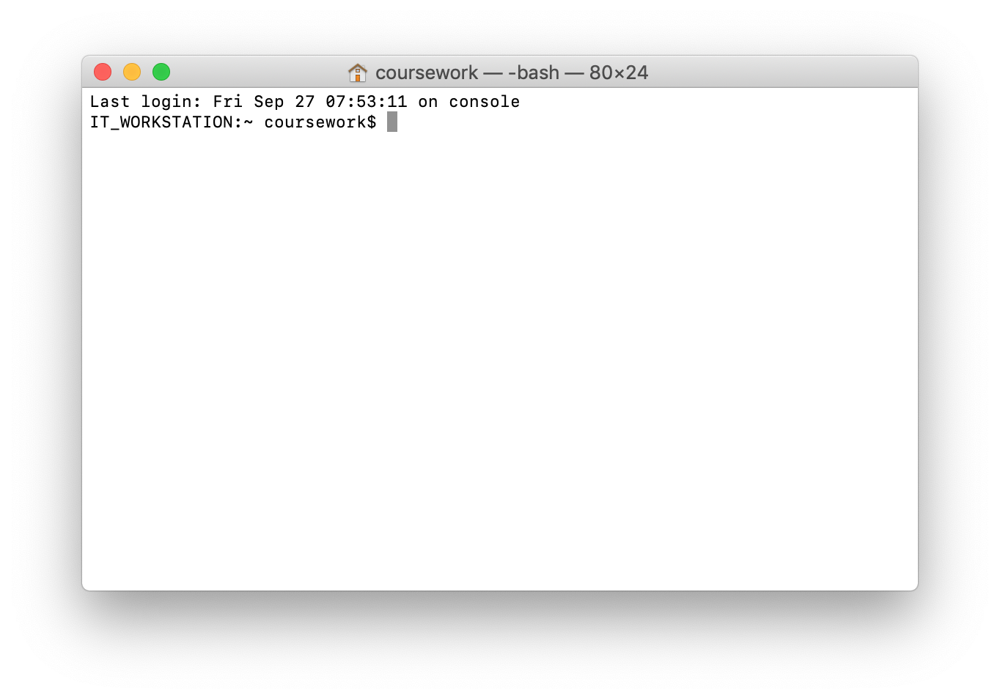
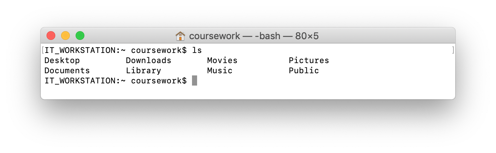
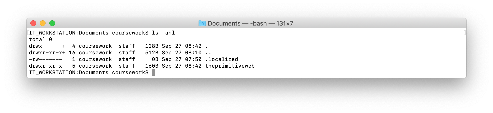
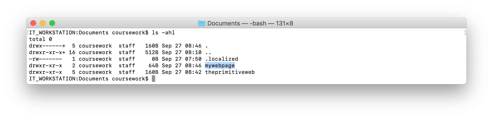
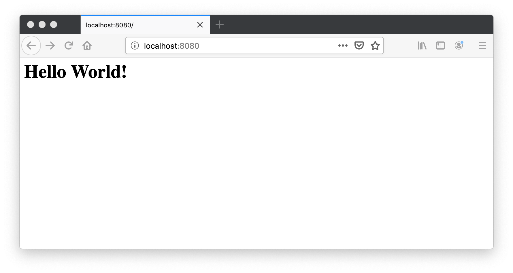
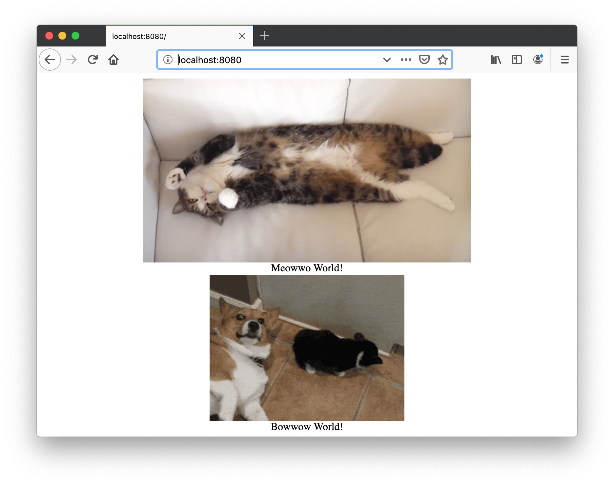

# Primitive Web (1.0) Publishing

### Get this walkthrough on your computer! Go to: [https://github.com/phillipdavidstearns/theprimitiveweb](https://github.com/phillipdavidstearns/theprimitiveweb)

## Hello!


* **`whoami`** - Phillip David Stearns (Artist, Designer, Engineer, Educator)
* **what is this?** - A walkthrough to re-discover the Internet and learn how to use the command line to make things.
* **who is it for?** - Sadly, this is geared to folks using Mac OSX (sorry, Windows users). This will work on Linux, or Unix operating systems, but hotkeys and terminal application functions will differ.
* **why?** - The Internet is a place for everyone and anyone can make a website. Internet tools can be used to locally host info offline (Intranet).


## 1. press `command+spacebar` to bring up the spotlight search bar



## 2. type `terminal` and press enter to launch the terminal



### This is your terminal

* We're used to the **graphic user interface (GUI)**
* terminal.app gives you a **command line interface*(CLI)**.
* **how to use**: type a command and then press enter




## 3. run `pwd` to see what your present working directory is

You should get something like:

```
/Users/coursework
```

* `pwd` shows us the **p**resent **w**orking **d**irectory

## 4. run `ls` to see what it in that directory



* **`ls`** "list directory contents"
* find out more using the `man` or "manual" command: `man ls`
* exit from the manual by pressing `q`

## 5. run `ls -ahl` to get more details about the directory contents



`-ahl` is an argument passed to the `ls` command. This argument contains the options:

* `-a` - list **a**ll of the contents (even hidden files)
* `-h` - show size in a **h**
* `-l` - output in a sigle-column **l**ist

## 6. run `cd Documents` to change your present working directory

**`cd`** changes your working directory

## 7. run `ls -ahl` to view its contents

Wow! You have a lot of junk in there!

## 8. run `mkdir mywebpage` to create a directory for your webpage

Run `ls -ahl` to check that it was created:



## 9. run `cd mywebpage` to change to that directory

Simple

## 10. run `pwd` to confirm your path

```
/Users/coursework/Documents/mywebpage
```

## 11. run `ls` to confirm it's empty


**\*crickets chirping\***

## 12. run `echo '<h1>Hello World!</h1>' > index.html` to create a webpage

* `echo` writes text to the standard output
* in this case, the text is enclosed in single quotes: `''` which means "don't interpret special characters"
* `>` redirects the output of the previous command to a specified file. If it doesn't exist, it'll create it, otherwise it overwrites the contents (!!!).

## 13. run `python -m SimpleHTTPServer 8080`

This will launch a server hosting your webpage on your own computer at `localhost` or `127.0.0.1`

* Python is a programming language.
* The `python` command, when entered by itself, is used to start the python language interpreter.
* `-m` tells python to execute a built-in module, in this case `SimpleHTTPServer`
* `SimpleHTTPServer` takes a port number as an argument, in this case we specify `8080` but it could be anything between `2` and `65535`

##14. open a web browser and enter `localhost:8080` in the URL navigation bar



## 15. return to the terminal and press `command+t` to create a new tab

* We need to leave the terminal window in which we ran the `SimpleHTTPServer` open and running.

## 16. run `pwd` to check that you're in the directory of your website

```
/Users/coursework/Documents/mywebpage
```

If not, you can`cd` directly to it: `cd /Users/coursework/Documents/mywebpage
`

## 17. run `mkdir images; cd images`

This creates a directory called "images" and changes to it. 

* You can string multiple commands together
* place `; ` between commands

## 18. grab a random cat or dog gif from the web:

* for cat poeple, run: `wget 'https://thecatapi.com/api/images/get?format=src&type=gif' -O cat.gif`
* for dog people, run `wget 'https://api.thedogapi.com/api/images/get?format=src&type=gif' -O dog.gif`

## 19. run `ls -alh` to confirm that it shows up as `./images/cat.gif` or `./images/dog.gif`


## 20. run `nano ../index.html` and edit the webpage to read:

For cats:

```
<html>
	<div align=center>
		<br>
		Meowwo World!
	</div>
</html>
```

For dogs:

```
<html>
	<div align=center>
		<br>
		Bowwow World!
	</div>
</html>
```

## 21. press `control+x`, then `y` and then `enter` to save and exit


## 22. in your browser, click refresh



## BONUS!

1. Run the command `ipconfig getifaddr en0` to find your IP address on your network.
2. Share this IP address with friends on your network. Have them navigate to `http://your.ip.address:8080` for example `http://192.168.0.123:8080`

## Clean up!

1. Turn off the `SimpleHTTPServer` by either closing the tab or by activating the terminal tab and pressing `control+c`
2. Delete files in the **images** directory using `rm ~/Documents/mywebpage/images/*`
3. Delete the **images** directory using `rmdir ~/Documents/mywebpage/images`
4. Delete files in the **mywebpage** directory using `rm ~/Documents/mywebpage/*`
5. Delete the **mywebpage** directory using `rmdir ~/Documents/mywebpage`

## All done!

Thanks for following along. You can find more of my work at

* [https://phillipstearns.com](https://phillipstearns.com)
* [https://github.com/phillipdavidstearns](https://github.com/phillipdavidstearns) 